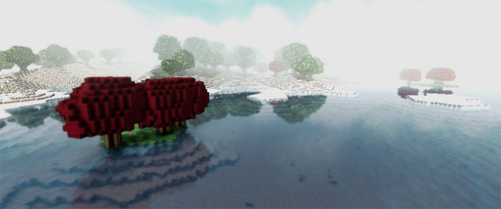
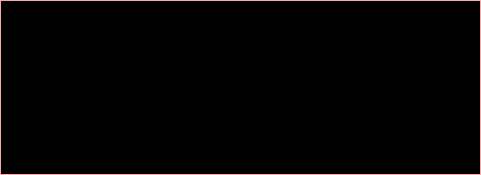
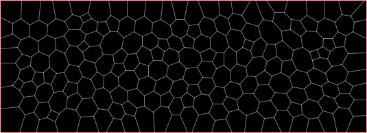
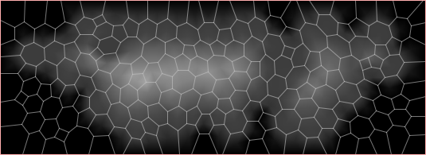
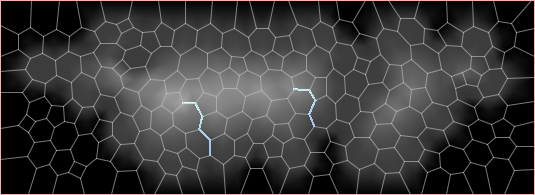
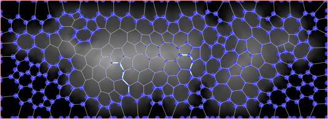
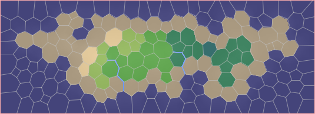
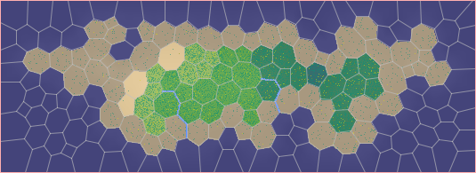
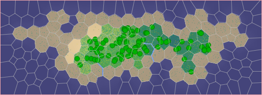

# PolyWorld

This is a polygon-based world generating module. It is based on the [map generating algorithm by Amit Patel of Red Blob Games](http://www-cs-students.stanford.edu/~amitp/game-programming/polygon-map-generation/).

The basic idea is to tesselate the terrain (using Fortune's algorithm) into a set of polygons.
Currently, only island worlds are supported. An island world is created as follows:

**Step 1:** Since the terrain is infinite, it needs to be partitioned into finite areas first:

**Step 2:** The area is tesselated into polygons. The algorithms behind this are approximate Poisson disc sampling to generate a well-behaved set of sampling points, Fortune's algorithm to compute the initial Voronoi diagram and Lloyd's relaxation to regularize the polygon shapes.

**Step 3:** Based on a random noise function such as Perlin noise, water and land vertices are defined. Starting at the border of the rectangle, the height of the island increases towards the center. Lake areas are flattened afterwards.

**Step 4:** Since the elevation gradient is monotonously increasing, rivers can start at any corner of the map, flow downhill
and always reach either a lake or the ocean.

**Step 5:** Based on height and the distance to rivers, a map of moisture is generated.

**Step 6:** Each of the regions is assigned to exactly one biome as defined by Whittaker.

**Step 7:** Each of the biomes has its unique distribution of flowers, mushrooms and other small plants.

**Step 8:** Same goes for different tree types.

### Acknowledgements

This module is loosely based on the Java implementation by [Connor Clark](https://github.com/Hoten/Java-Delaunay).

### License

This module is licensed under the [Apache 2.0 License](http://www.apache.org/licenses/LICENSE-2.0.html).
