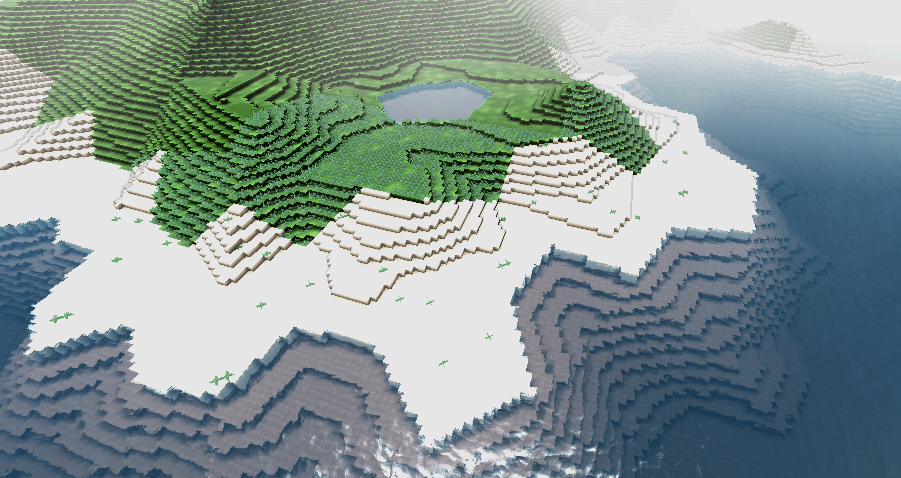
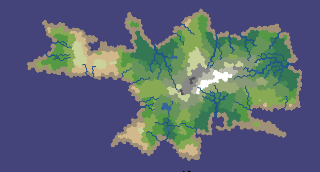

# PolyWorld

Based on the [map generating algorithm by Amit Patel of Red Blob Games](http://www-cs-students.stanford.edu/~amitp/game-programming/polygon-map-generation/).

This module requires [TeraMath]().

### Acknowledgements

This module is loosely based on the Java implementation by [Connor Clark](www.hotengames.com).

### License

This module is licensed under the [Apache 2.0 License](http://www.apache.org/licenses/LICENSE-2.0.html).